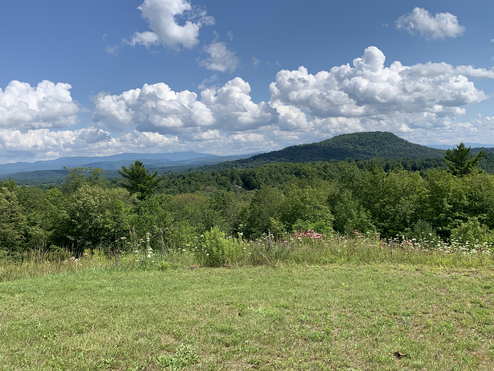

<html>
	<head>
		<title>Morgan Swain</title>
		<meta charset="utf-8" />
		<meta name="viewport" content="width=device-width, initial-scale=1, user-scalable=no" />
		<link rel="stylesheet" href="assets/css/main.css" />
	</head>
	<body class="is-preload">

		<!-- Header -->
			<section id="header">
				<header>
					
					
					<h1 id="logo"><a href="#">Morgan Swain</a></h1>
					
  
						B.S. in Mathematics  
						Minor in Anthropology 
						University of Vermont, Burlington, VT
					

				</header>
				<nav id="nav">
					<ul>
						<li><a href="#one" class="active">About</a></li>
						<li><a href="#two">Skills</a></li>
						<li><a href="#three">Portfolio</a></li>
						<!-- <li><a href="#four">More</a></li> -->
					</ul>
				</nav>
				<footer>
					<ul class="icons">

						<li><a href="https://github.com/morganswain13" class="icon brands fa-github">Github</a></li>
						<li><a href=mailto:morganswain13@gmail.com class="icon solid fa-envelope">Email</a></li>
					</ul>
				</footer>
			</section>

		<!-- Wrapper -->
			

				<!-- Main -->
					

						<!-- One -->
							<section id="one">
								

									
								

								

									<header class="major">
										<h2>Morgan Swain</h2>
										
A personal website, <a href="SwainResume.pdf">resume</a>, portfolio, etc. 
 
										<!-- I put together to demonstrate that I can copy and paste <b><i>the right</i></b> code. -->
									</header>
									<h4>Background</h4>
									
 Coming from 40 minutes north of Boston, a town called Andover, Massachusetts, I came up to Vermont to experience the variety of outdoor activities and beautiful views it has to offer. I am very passionate about environmental justice and preserving the Earth for future generations. Serving as the Networking Chair of the Women in STEM Club at UVM, I am also passionate about advocating for women's rights for equal pay and education in the Mathematics and Statistics fields. Currently, I am working as a Data Technician Intern for the Forest Ecosystem Monitoring Cooperative in South Burlington, as well as a Peer Mentor for the College of Engineering and Mathematical Sciences at UVM. Outside of work and school, I enjoy spending time with animals, rollerblading on the bike path, and swimming in the lake.  
									

									<h4>Education</h4>
									
I am currently in my final year at the University of Vermont, graduating with a bachelor of sciences in Mathematics in May 2023. This degree encompasses my interests in applied and theoretical computer science, data analysis, and pure and applied mathematics. In my current job as a Data Technicinan at a small scale environmental cooperative, I am aiming to align my interests in sustainability with data science. I am also minoring in Anthropology, which gives me the tools to think and communicate in abstract ways. 

								

							</section>

						<!-- Two -->
							<section id="two">
								

									<h3>Tricks I've Learned</h3>
									
Technical skills I've developed through my education, personal interests, and prior work experience.

									<ul class="feature-icons">
										<li class="icon solid fa-code"><b>Data Analysis</b>  R, Python, MATLAB</li>
										<li class="icon solid fa-user-crown"><b>Leadership</b> CEMS Peer Mentor, Networking Chair for the Women in STEM Club, Teaching Assistant for Anthropology 189: Aging in the Cross-Cultural Perspective</li>
										<li class="icon solid fa-calculator-simple"><b>Discrete Math</b> Elementary Number Theory, Graph Theory, Linear Algebra, Combinatorics</li>
										<!-- <li class="icon solid fa-coffee">Drink much coffee</li>
										<li class="icon solid fa-bolt">Lightning bolt</li> -->
										<li class="icon solid fa-comment"><b>Technical Communication</b> Able to translate abstract ideas into English </li>
									</ul>
								

							</section>

						<!-- Three -->
							<section id="three">
								

									<h3>A Few Projects</h3>
									
 Below lies some coursework which emphasizes some of my interests and skills. Click for more information.

									

										<article>
											
											

												<a href="https://github.com/morganswain13/morganswain13.github.io/blob/95adeb96218298b75726651af6e6cf3debd529c8/Burlington%20Tree%20Health%20Project.pdf"><h4>Burlington Tree Health Project</h4></a>
												
Collaborated with a team of 3 other students through a course at the University of Vermont, Statistics 187: Basics of Data Science, to successfully clean and analyze tree health data from the Burlington City Arborists. Used R to create correlation plots and interactive maps to showcase tree health accross the city. 

											

										</article>
										<article>
											
											

												<a href="https://github.com/morganswain13/morganswain13.github.io/blob/95adeb96218298b75726651af6e6cf3debd529c8/Physical%20Health%20and%20Employment%20on%20Mental%20Health.Rmd"><h4>Measuring Physical Health and Employment on Mental Health in New England</h4></a>
												
Analyzed the relationship between employment and physical and mental health using data from ___. Answers questions such as: Is fatigue score independent of employment status in New England? Does social isolation t-score change between drinkers and non-drinkers for people 40 years old or above? Is there a relationship between physical function and mental health status in New England?

											

										</article>
										<article>
											
											

												<a href="https://github.com/morganswain13/morganswain13.github.io/blob/95adeb96218298b75726651af6e6cf3debd529c8/Blog_%20Ecofeminism.pdf"><h4> EcoFeminism Blog for BYOTogo</h4></a>
												
A blog written during my time as a Digital Marketing Intern in Spring of 2021 in honor of Women's History Month. Discusses the relationship between feminism and ecology, and leaves key takeaways for the reader. 

											

										</article>
									

								

							</section>
					

				<!-- Footer -->
					<section id="footer">
						

							<ul class="copyright">
								<li>&copy; Made by Morgan Swain using a free HTML template found on the Internet.</li>
							</ul>
						

					</section>

			

		<!-- Scripts -->
			
			
			
			
			
			
			

	</body>
</html>
